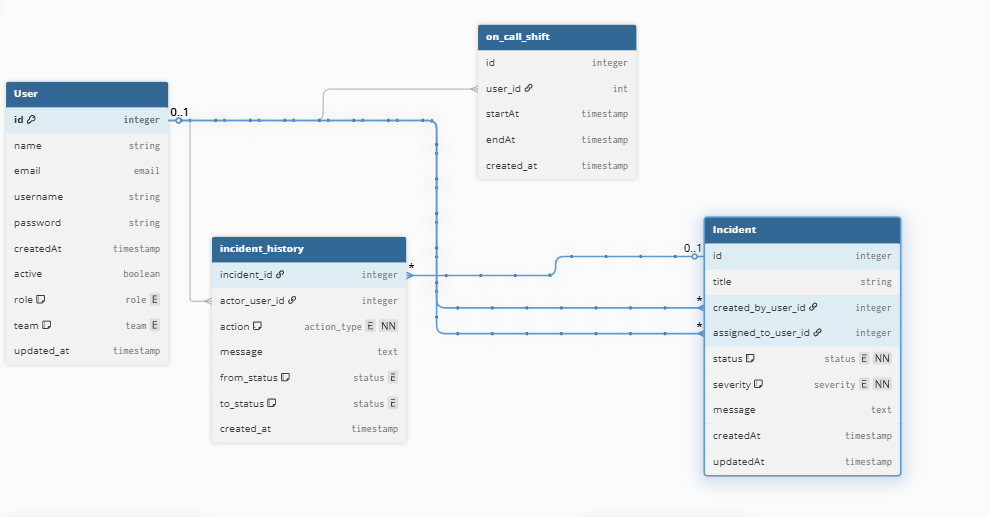
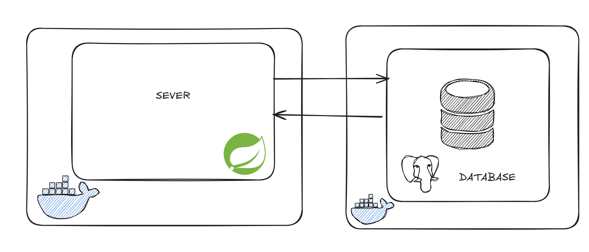
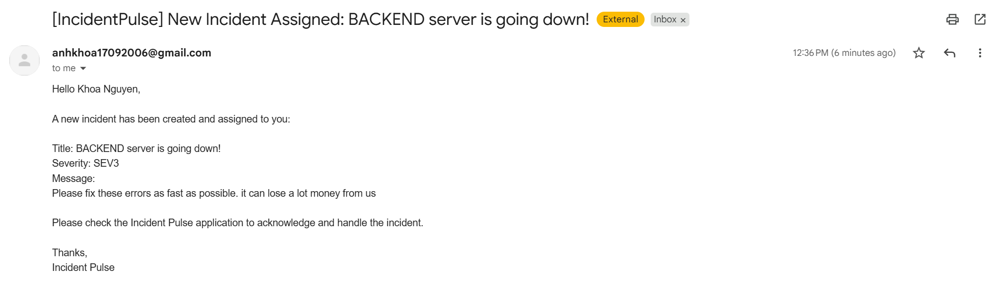
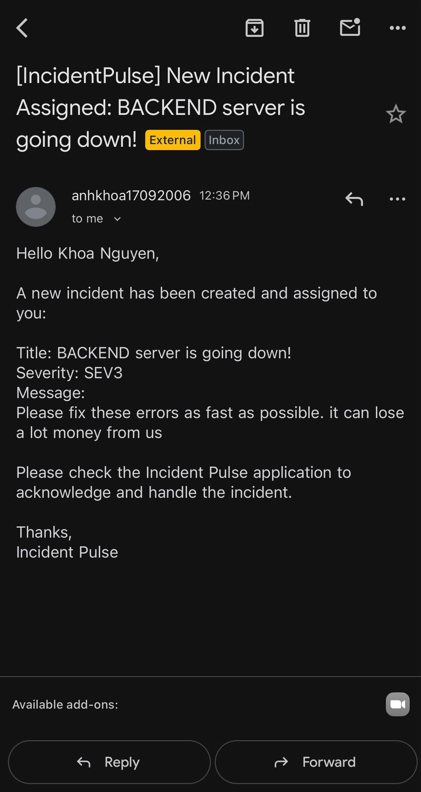

# IncidentPulse

Problem:
Imaging your api or a critical service goes down. 
if you can not detect the issue, creat an incident, and assign on call engineer quickly. The business will lose thousands or even
millions of dollars.

Solution:
Incident Pulse will allow client, admins, leaders, or non-on call engineer to create incident immediately when something goes down.
The system will automatically assign the current on-call engineer and send an email notification, so issues can be addressed as fast as possible and downtime is minimized.  

Flow:
client, admin, lead, other engineer create an incident (
monitor, and autodetect in the future
) -> system will automatically assign on-call engineer and send an email notification 
-> on-call engineer will log in and change status from open to investigating,
multiple engineer can solve the incident but if one engineer post completely, no one can not change the status 
excluding admin, and lead team. 

Another feature: admin, leader, and engineer can get all incidents history to help them investigate a root to cause these incidents.
Java email sender and using algorithm to calculate who will on-call engineer.

ERD diagram:

System Design:

Email Send in Laptop:

Email Send in Phone:

